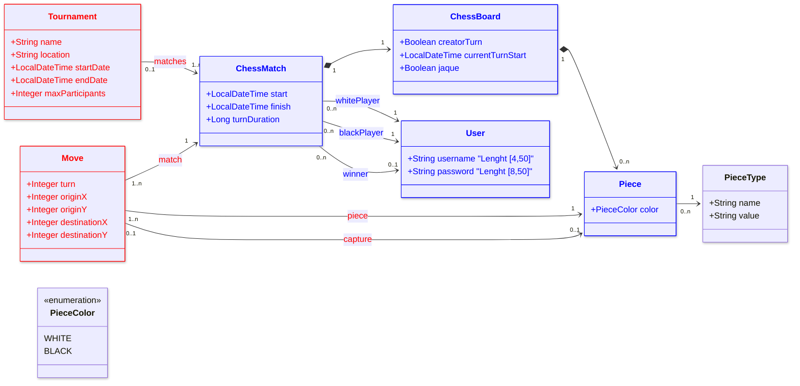

```mermaid
---
config:
  layout: dagre
  look: neo
---
classDiagram
direction LR
   
    class User {
	    +String username "Lenght [4,50]"
	    +String password "Lenght [8,50]"
    }    

    class Move {
	    +Integer turn
	    +Integer originX
      +Integer originY
      +Integer destinationX
      +Integer destinationY	    
    }
    class ChessMatch {
	    +LocalDateTime start
	    +LocalDateTime finish
	    +Long turnDuration
    }
    class ChessBoard {
	    +Boolean creatorTurn
	    +LocalDateTime currentTurnStart
	    +Boolean jaque
    }
    class Piece {
	    +PieceColor color	          
    }
    class PieceType {
      +String name
      +String value
    }
    class Tournament {
      +String name
      +String location
      +LocalDateTime startDate
      +LocalDateTime endDate
      +Integer maxParticipants
    }
    class PieceColor {
	    WHITE
      BLACK
    }
	  
  <<enumeration>> PieceColor    
    Move "1..n" --> "1" ChessMatch : <font color='red'>match</font>
    Move "1..n" --> "1" Piece : <font color='red'>piece</font>
    Move "0..1" --> "0..1" Piece : <font color='red'>capture</font>
    Tournament "0..1" --> "1..n" ChessMatch : <font color='red'>matches</font>

    ChessMatch "1" *--> "1" ChessBoard
    ChessMatch "0..n" --> "1" User : <font color='blue'>whitePlayer</font>
    ChessMatch "0..n" --> "1" User : <font color='blue'>blackPlayer</font>
    ChessMatch "0..n" --> "0..1" User : <font color='blue'>winner</font>
    ChessBoard "1" *--> "0..n" Piece:  
    Piece "0..n" --> "1" PieceType        
	style Tournament stroke:red,color:red	
	style Move stroke:red,color:red
	style ChessMatch stroke:blue,color:blue
	style ChessBoard stroke:blue,color:blue
  style Piece stroke:blue,color:blue  
  style User stroke:blue,color:blue
```